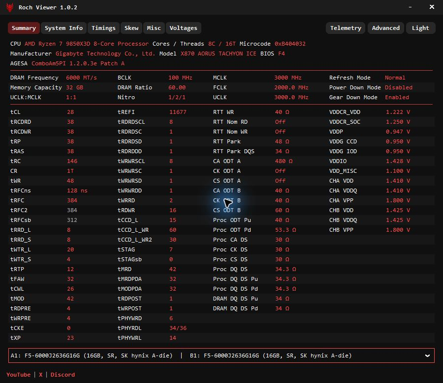
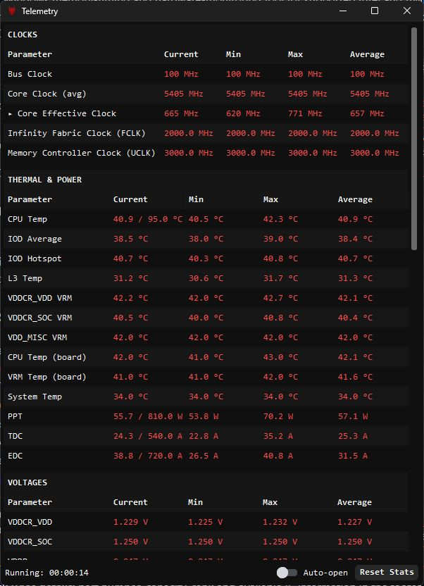
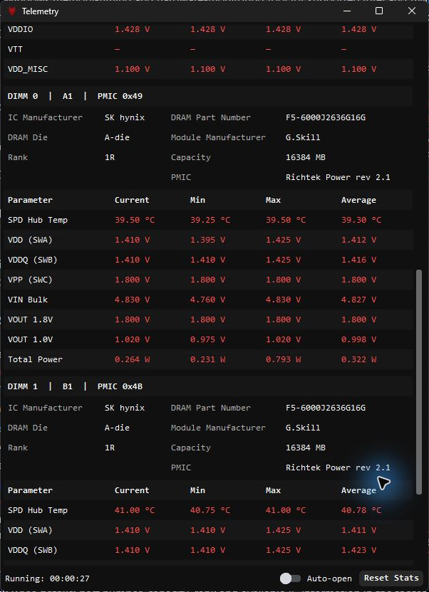

# Roch Viewer 1.0.2

Version 1.0.2 is an unreleased source build.

A read-only Windows memory-timing and hardware-monitoring tool for supported Intel and AMD systems. View clocks, timings, per-channel settings, RAM details and native CPU/memory telemetry in a compact light/dark interface. No HWiNFO dependency.

## Install

1. Download `RochViewer.exe` from [Releases](https://github.com/RochStudio/Roch-Viewer/releases).
2. Obtain `inpoutx64.dll` from [Highresolution Enterprises](https://www.highrez.co.uk/downloads/inpout32/) and place it beside the executable. It is **not bundled**.
3. Run `RochViewer.exe` as administrator.

Windows 10/11 x64 is required. The packaged EXE needs no Python or .NET installation.

## Prerequisites

The InpOut DLL contains a kernel driver and can install a persistent Windows service on first elevated use. Windows security policies may block it; hardware-register readings then remain unavailable. Do not disable protections just to load it. Read the [driver details](docs/reference.md#prerequisites).

## Features

- **Summary:** CPU/board identity, memory speed, DRAM Ratio below BCLK, supported MCLK/UCLK/FCLK readings, key timings and voltage snapshots. Select one module or all modules; matching channel values display once and differences display side by side.
- **System Info:** processor, motherboard, BIOS, RAM and graphics-card identity.
- **Timings:** primary, secondary and tertiary timings, including per-channel values where exposed, in a compact layout with aligned alternating row shading.
- **Voltages:** startup snapshots of supported CPU, motherboard and memory rails. Use Telemetry for live readings.
- **Skew and Misc:** supported RTT/ODT, drive strengths, VREF, training and controller configuration fields. AMD Misc includes native preamble/postamble and ECC status (memory-controller ECC, not DDR5 on-die ECC). Granite Ridge also exposes eight raw training codes using the reference tool's labels; those labels are not verified physical VREF/DFE readings. Unavailable reads stay blank.
- **Native telemetry:** CPU/effective clocks, temperatures, power and supported board voltages, plus each DIMM's temperature and PMIC rails. Current/minimum/maximum/average statistics and reset controls are included.
- **Per-stick RAM details:** part number, capacity, rank and available IC information in the footer and telemetry.
- **Shared Roch interface:** light/dark themes, consistent toolbar buttons, and YouTube | X | Discord links at the bottom-left.
- **Advanced view:** searchable fields and a text dump for comparing configurations or reporting issues.
- **Read-only:** no overclocking controls or voltage writes. Low-level selectors and query transactions retrieve readings only.

Version 1.0.2 source includes the red-bordered module selector, consistent rounded toolbar buttons, resistance units and explicit Off states, improved row shading, Gigabyte split channel/socket labels, and VDDIO on the tested X870 AORUS TACHYON ICE. Graphics was removed from telemetry; GPU identity remains in System Info. These changes are not in the published 1.0.1 download yet.

## Screenshots







Actual updated local-build screenshots, not UI concepts. Values shown are examples, not tuning recommendations.

## Hardware support

Intel LGA1700/LGA1851 and supported AMD AM5/Granite Ridge systems. Readings depend on CPU, memory type, motherboard, BIOS and driver access. Unsupported values stay unavailable; board sensor mappings are not assumed to transfer between models. See [validation history and limitations](docs/reference.md).

## Build from source

Install **Python 3.13 x64** with Tkinter, then run:

```powershell
py -3.13 -m pip install -r requirements.txt
py -3.13 -m PyInstaller -y RochViewer.spec
```

Output: `dist\RochViewer.exe`. Put the separately obtained `inpoutx64.dll` beside it. To run from source, put the DLL beside `run_viewer.py` and use `pyw -3.13 run_viewer.py`.

Tests: `py -3.13 -m unittest discover -s tests -t .`

## Credits

- **Ivan Rusanov (irusanov) — [ZenStates-Core](https://github.com/irusanov/ZenStates-Core) and [ZenTimings](https://github.com/irusanov/ZenTimings):** AMD register, timing and SMU references.
- **Highresolution Enterprises / Logix4u — InpOut32/64:** separately supplied low-level access component.
- **[LibreHardwareMonitor](https://github.com/LibreHardwareMonitor/LibreHardwareMonitor):** board-sensor register and mapping references.
- **Zorko — gnr-smu:** independent Granite Ridge SMU mailbox research.

Created by **Roch Studio / MateoPCTech**.

[YouTube](https://www.youtube.com/@MateoPcTech) | [X](https://x.com/MateoPCTech) | [Discord](https://discord.gg/KfzExpKQHB)

[License](LICENSE) · [Third-party notices](THIRD_PARTY_NOTICES.txt) · [Detailed reference](docs/reference.md)

> Low-level hardware access carries risk, even in a read-only tool. Provided as-is, without warranty.
